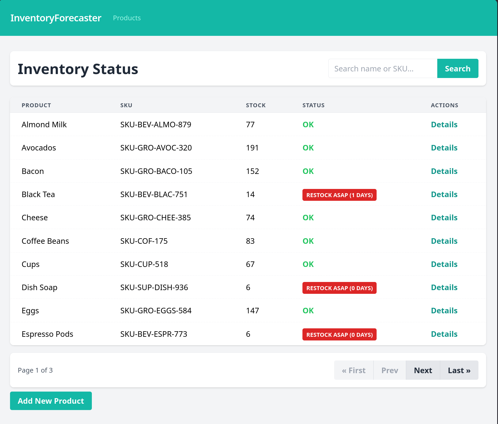
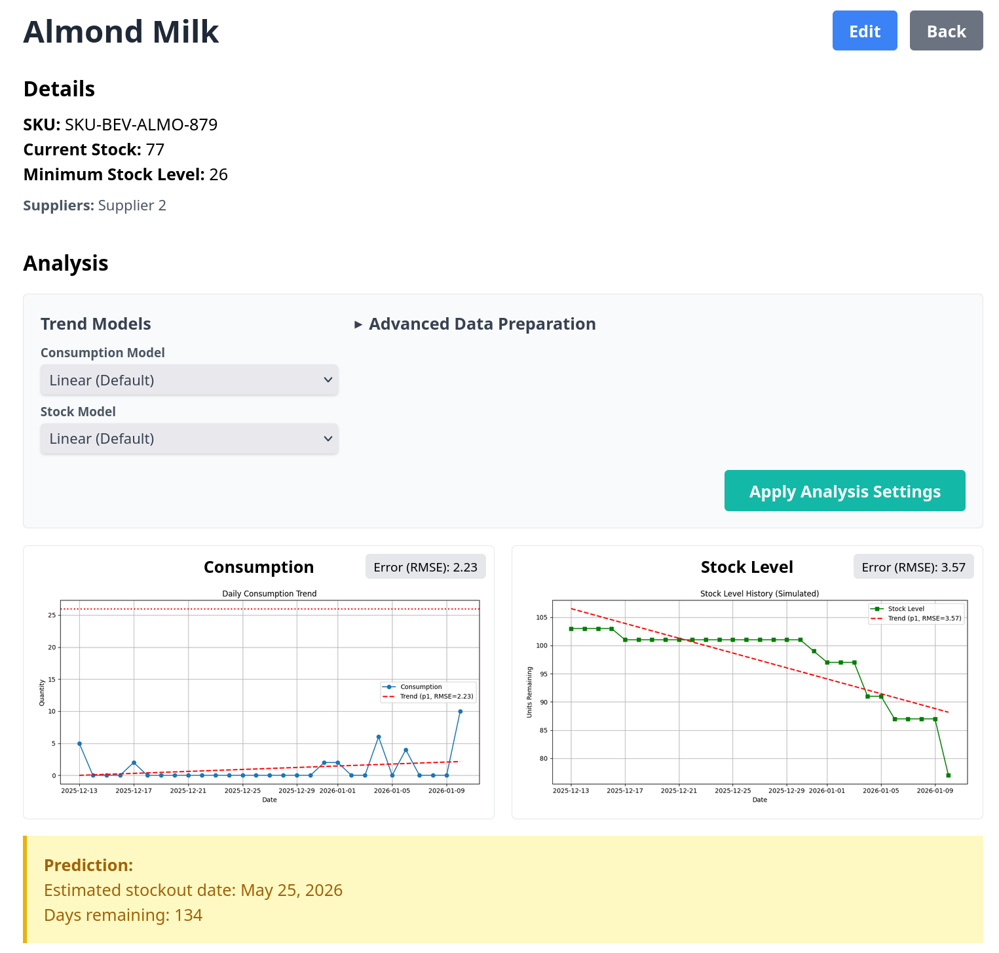

# Smart Inventory Forecaster

Система управления инвентарем для малого бизнеса, предназначенная для отслеживания запасов и прогнозирования трендов потребления. Помогает избежать кассовых разрывов и дефицита товара за счет предиктивной аналитики.

**Ссылка на рабочий проект:** [[Ссылка на PythonAnywhere](https://steffanbreak.pythonanywhere.com/)]

## Технологии
*   **Python 3.x**
*   **Django 4.2+**
*   **Pandas** (Анализ временных рядов потребления)
*   **Matplotlib** (Визуализация трендов)
*   **Tailwind CSS** (Современный UI)

## Скриншоты

*Список товаров с индикацией остатков*


*График потребления и прогноз истощения запасов*

## Как запустить проект локально

1.  **Клонируйте репозиторий:**
    ```bash
    git clone https://github.com/your-username/inventory_manager.git
    cd inventory_manager
    ```

2.  **Создайте и активируйте виртуальное окружение:**
    ```bash
    python3 -m venv venv
    source venv/bin/activate
    ```

3.  **Установите зависимости:**
    ```bash
    pip install -r requirements.txt
    ```

4.  **Выполните миграции:**
    ```bash
    python manage.py migrate
    ```

5.  **Заполните базу тестовыми данными:**
    ```bash
    python manage.py seed_data
    ```

6.  **Создайте суперпользователя (опционально):**
    ```bash
    python manage.py createsuperuser
    ```

7.  **Запустите сервер:**
    ```bash
    python manage.py runserver
    ```

8.  **Откройте проект в браузере:**
    Перейдите по ссылке: http://127.0.0.1:8000/
